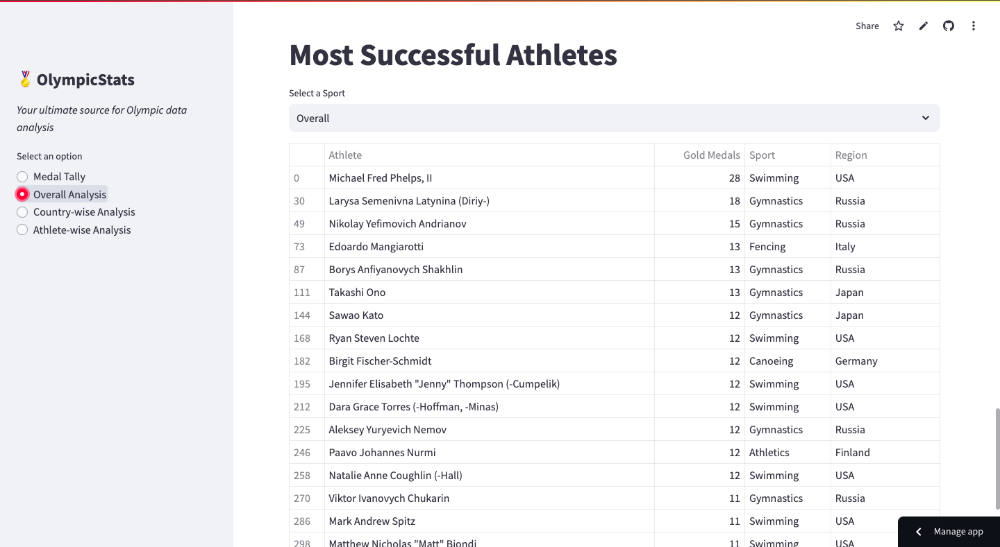

# 🏅 OlympicStats 

**An interactive data visualization tool that provides detailed statistics and insights about the Olympic Games, including medal counts, country rankings, athlete achievements, and event histories. This project is built using Streamlit for a user-friendly web interface.**

  

## Objective 🎯

The **OlympicStats** app is designed to help users explore comprehensive Olympic Games data in an interactive and easy-to-understand way. It is particularly useful for:

- **Sports Enthusiasts & Analysts**: Discover historical Olympic statistics, analyze trends in medal counts, and explore the performance of different countries and athletes across various Olympic events.
- **Researchers & Data Scientists**: Use the tool to analyze Olympic datasets, extract trends, and build insights on global participation, performance, and more.
- **Education & Awareness**: Educators and students can use this tool to gain insights into Olympic history and learn about countries' and athletes' performances over time.

## How It Works ⚙️

1. **Input**: The app provides various input filters, such as selecting a specific Olympic year, country, or sport.
2. **Processing**: The data is fetched and processed from a reliable Olympic dataset, which includes statistics like medal counts, athlete performance, and country rankings.
3. **Output**: The user can visualize the data through interactive charts, tables, and visualizations. Insights like the most successful countries, top-performing athletes, and historical trends are displayed.

## Features ✨

- 📊 **Interactive data visualizations**, including charts and tables.
- 🥇 **Displays medal counts** and performance metrics by country and year.
- 🌍 **Ability to explore performance by specific sports** or Olympic events.
- 🖥️ **Clean and user-friendly interface** powered by Streamlit.
- 🔄 **Option to compare** data across multiple Olympic Games and years.

## Requirements 📋

To run this application locally, you need to install the following dependencies:

    ```
    pip install -r requirements.txt
    ```
## Setup and Installation 🚀

1.  **Clone the repository:**

    ```bash
    git clone https://github.com/bushraqurban/OlympicStats.git
    cd OlympicStats
    ```
2.  **Create a virtual environment and activate it (optional but recommended):**
         
    ```bash
    # On Mac/Linux:
    python3 -m venv venv
    source venv/bin/activate
    ```
    
    ```bash
    # On Windows
    python -m venv venv 
    .\venv\Scripts\activate
    ```

3.  **Install the required dependencies:**

    ```bash
    pip install -r requirements.txt` 
    ```
4.  **Run the application:**

    ```bash
    streamlit run app.py
    ```

This will open the app in your default browser.

## How to Use 🧑‍💻

1.  Open the app by visiting [OlympicStats Streamlit App](https://olympicstat.streamlit.app/).
2.  Use the provided filters to select a year, country, or sport.
3.  Explore the different visualizations and statistics displayed on the app.
4.  You can click through the charts to dive deeper into specific insights or countries.


## Future Improvements 🌱

-   **More detailed data integration**: Expand the dataset to include more granular information about athletes, records, and Olympic events.
-   **User accounts and personalized data tracking**: Allow users to save and track their preferred countries, sports, or athletes for quicker access.
-   **Enhanced interactivity**: Add more filtering options for users to drill deeper into specific events, countries, or athletes.


## License 📜

This project is licensed under the MIT License - see the LICENSE file for details.


## Project Acknowledgment 🏆

This project was guided by the content from the YouTube channel **[Campusx](https://www.youtube.com/@campusx-official)**. Their tutorials and resources provided a solid foundation for building an interactive dashboard to explore Olympic statistics.


## Technologies Used 🛠️

-   **Streamlit**: For building the interactive web application.
-   **Pandas**: For data manipulation and analysis.
-   **Matplotlib** and **Plotly**: For creating interactive visualizations.
-   **Seaborn**: For enhanced visual aesthetics in the charts.
-   **Python**: The core language for processing and analysis.

----------
